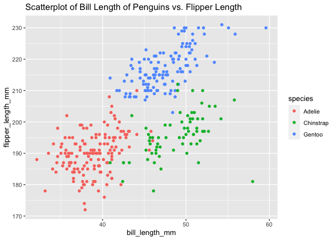

p8105\_hw1\_yw3439
================
Qetsiyah Wang
9/17/2020

## Problem.1 - Data frome and Variable

``` r
frame_x = tibble(
  sample_x = rnorm(10),
  logi_vec = sample_x > 0,
  subj_char = c("math", "english", "history", "chinese", "science", "biology", 
               "politics", "geography", "physics", "chemistry"),
  county_fac = as.factor(c("Manhattan","Manhattan","Manhattan","Manhattan", 
                        "Queen", "Queen", "Queen",
                        "Bronx", "Bronx", "Bronx"))
)

mean_sample = mean(pull(frame_x, sample_x))
mean_logi = mean(pull(frame_x, logi_vec))
mean_char = mean(pull(frame_x, subj_char))
```

    ## Warning in mean.default(pull(frame_x, subj_char)): argument is not numeric or
    ## logical: returning NA

``` r
mean_fac = mean(pull(frame_x, county_fac))
```

    ## Warning in mean.default(pull(frame_x, county_fac)): argument is not numeric or
    ## logical: returning NA

``` r
knitr::kable(frame_x)
```

|   sample\_x | logi\_vec | subj\_char | county\_fac |
| ----------: | :-------- | :--------- | :---------- |
|   0.5726422 | TRUE      | math       | Manhattan   |
|   0.5597723 | TRUE      | english    | Manhattan   |
| \-1.3026831 | FALSE     | history    | Manhattan   |
|   0.2138611 | TRUE      | chinese    | Manhattan   |
| \-0.0249582 | FALSE     | science    | Queen       |
|   0.0295232 | TRUE      | biology    | Queen       |
|   0.1853763 | TRUE      | politics   | Queen       |
| \-1.0486363 | FALSE     | geography  | Bronx       |
|   1.9409961 | TRUE      | physics    | Bronx       |
| \-0.1724575 | FALSE     | chemistry  | Bronx       |

In the data frame x, sample\_x is numeric containing random numbers from
a standard distribution. logi\_vec contains boolean statements from
identifying if the vector in sample\_x is bigger than 0. subj\_char
consists of subjects as character vectors. county\_fac has 10 vectors
with 3 different factor levels “Manhattan”, “Queen” and “Bronx”. While
taking the mean for each variable, there is a warning coming up showing
that argument is not numeric or logical so that returning NA. Only
sample\_x and logi\_vec have mean results but not subj\_char and
county\_fac, because vectors in subj\_vec are characters and in
county\_fac are factors, which both cannot be applied with the mean
function.

``` r
frame_x %>%
  mutate(
    logi_vec = as.numeric(logi_vec),
    subj_char = as.numeric(subj_char),
    county_fac = as.numeric(county_fac)
  )

mean_sample = mean(pull(frame_x, sample_x))
mean_logi = mean(pull(frame_x, logi_vec))
mean_char = mean(pull(frame_x, subj_char))
mean_fac = mean(pull(frame_x, county_fac))
```

After using the as.numeric function, while applying the mean function
with all four variables, there is no any warning popping out anymore.
That is because that vectors in all four variables change into double
vectors by as.numeric, allowing four variables to be able to calculate
the mean through the same function used before.

``` r
frame_x_logi = frame_x %>%
  mutate(
    num_logi = (as.numeric(logi_vec))*sample_x,
    fac_logi = as.factor(logi_vec)*sample_x,
    num_fac_logi = (as.numeric(as.factor(logi_vec)))*sample_x
  ) %>%
  select(num_logi, fac_logi, num_fac_logi)
```

    ## Warning: Problem with `mutate()` input `fac_logi`.
    ## ℹ '*' not meaningful for factors
    ## ℹ Input `fac_logi` is `as.factor(logi_vec) * sample_x`.

    ## Warning in Ops.factor(as.factor(logi_vec), sample_x): '*' not meaningful for
    ## factors

``` r
knitr::kable(frame_x_logi)
```

| num\_logi | fac\_logi | num\_fac\_logi |
| --------: | :-------- | -------------: |
| 0.5726422 | NA        |      1.1452844 |
| 0.5597723 | NA        |      1.1195446 |
| 0.0000000 | NA        |    \-1.3026831 |
| 0.2138611 | NA        |      0.4277222 |
| 0.0000000 | NA        |    \-0.0249582 |
| 0.0295232 | NA        |      0.0590465 |
| 0.1853763 | NA        |      0.3707526 |
| 0.0000000 | NA        |    \-1.0486363 |
| 1.9409961 | NA        |      3.8819922 |
| 0.0000000 | NA        |    \-0.1724575 |

Using as.numeric function for logi\_vec changes the original boolean
into numeric vectors that allows further calculation with sample\_x.
While using as.factor function for logi\_vec, boolean changes from
boolean into factors which are still not applicable for the numeric
calculation. However, after using as.numeric for changing the factors
into the numeric type, vectors now in fac\_logi are able to apply for
the mathematical calculation with sample\_x.

## Problem. 2 - Penguins

``` r
data("penguins", package = "palmerpenguins")
```

The dataset “penguins” contained 8 variables and 344 observations. The
dataset describes different features of penguins, including their
species, island, bill\_length\_mm, bill\_depth\_mm, flipper\_length\_mm,
body\_mass\_g, sex, year. The whole dataset contains 3 types of
penguins, Adelie, Chinstrap, Gentoo. They are from different islands,
Biscoe, Dream, Torgersen. The bill length ranges from 32.1 mm to 59.6
mm. The body mass ranges from 2700 g to 6300 g. The mean of the flipper
length is 200.9152047 mm.

``` r
penguins %>%
  ggplot(aes(x = bill_length_mm, y = flipper_length_mm, color = species)) +
  geom_point(na.rm = TRUE) +
  labs(title = "Scatterplot of Bill Length of Penguins vs. Flipper Length") 
```

<!-- -->

``` r
ggsave("penguins.png")
```

    ## Saving 7 x 5 in image
